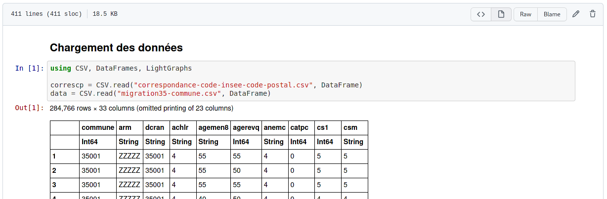

Ce dépôt contient le code utilisé pour produire la narration produite lors du challenge d'analyse de données "Datarennes".

- desciption sur le site de MaDICS https://www.madics.fr/event/titre1622474704-1140/

## Installation

Télécharger le jeu de données à l'adresse https://www.kaggle.com/patrickmarcel/migration-35-par-commune et l'extraire.

https://public.opendatasoft.com/explore/dataset/correspondance-code-insee-code-postal/table/ (code postaux)

Documentation dans le pdf https://www.insee.fr/fr/statistiques/fichier/5395755/contenu_RP2018_migcom.pdf

Installer les dépendances Julia depuis le fichier `Project.toml`.

Lire le cahier en Julia `explore.ipynb`.

## Narration

Lors de l'analyse des données, la commune "La Selle-Gerchaise" a été identifiée comme la seule non connexe dans le graphe des migrations. Nous avons donc choisi de broder autour de cette découverte à travers une vidéo humoristique sous la forme d'un détournement de journal télévisé. La faiblesse méthodologique de la réalisation doit être imputée au temps très court que nous lui avons consacré.

> ⚠️ attention, ton parodique

## Sources

- données des migrations INSEE https://www.insee.fr/fr/statistiques/5395755?sommaire=5395764
- site de la commune http://www.laselleguerchaise.fr/
- photo de l'équipe municipale et citation https://actu.fr/bretagne/la-selle-guerchaise_35325/municipales-2020-la-selle-guerchaise-quatre-conseillers-sortants-ont-monte-une-liste_31963556.html
- chiffre des élections https://elections.actu.fr/bretagne/la-selle-guerchaise_35325/municipales-2020
- reportage sur Édith Capèle https://www.produire-bio.fr/temoignages/edith-et-pascal-capele-bovins-lait-ille-et-vilaine/

Les extraits vidéos détournés ont été utilisé _sans_ autorisation.
